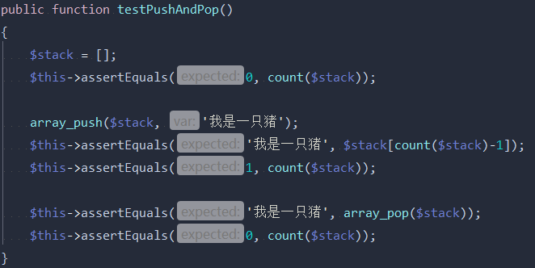
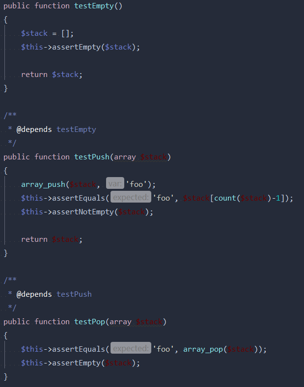

# PHPUnit
<a href="https://phpunit.de" target="view_window">`link: https://phpunit.de`</a>

### PHPUnit安装
    wget https://phar.phpunit.de/phpunit-6.2.phar
    chmod +x phpunit-6.2.phar
    sudo mv phpunit-6.2.phar /usr/local/bin/phpunit
    phpunit --version

### composer依赖
    composer require --dev phpunit/phpunit ^6.3

### 编写PHPUnit测试
* 针对类 Class 的测试写在类 ClassTest中。

* ClassTest（通常）继承自 PHPUnit\Framework\TestCase。

* 测试都是命名为 test* 的公用方法。 也可以在方法的文档注释块(docblock)中使用 @test 标注将其标记为测试方法。

    Time: 157 ms, Memory: 6.00MB

    OK (1 test, 5 assertions)

### 命令行测试
    phpunit ArrayTest
    PHPUnit 6.4.0 by Sebastian Bergmann and contributors.

    ..

    Time: 0 seconds

    OK (2 tests, 2 assertions)

PHPUnit在当前工作目录中寻找ArrayTest.php文件并加载，对于每个测试运行，PHPunit命令行工具都会输出一个字符显示进展

> . 当测试成功时输出

> F 当测试运行过程中一个断言失败时输出

> E 当测试运行过程中产生一个错误时输出

> R 当测试被标记有风险时输出

> S 当测试被跳过时输出

> I 当测试被标记为不完整或未实现时输出

### 测试的依赖关系
PHPUnit支持对测试方法之间的显式依赖关系进行声明。这种依赖关系并不是定义在测试方法的执行顺序中，而是允许生产者(producer)返回一个测试基境(fixture)的实例，并将此实例传递给依赖于它的消费者(consumer)们。

* 生产者(producer)，是能生成被测单元并将其作为返回值的测试方法。
* 消费者(consumer)，是依赖于一个或多个生产者及其返回值的测试方法。

    ...                                            3 / 3 (100%)
    Time: 148 ms, Memory: 6.00MB
    OK (3 tests, 5 assertions)

> 注意事项 

* 默认情况下，生产者所产生的返回值将“原样”传递给相应的消费者。这意味着，如果生产者返回的是一个对象，那么传递给消费者的将是一个指向此对象的引用。如果需要传递对象的副本而非引用，则应当用 @depends clone 替代 @depends。
