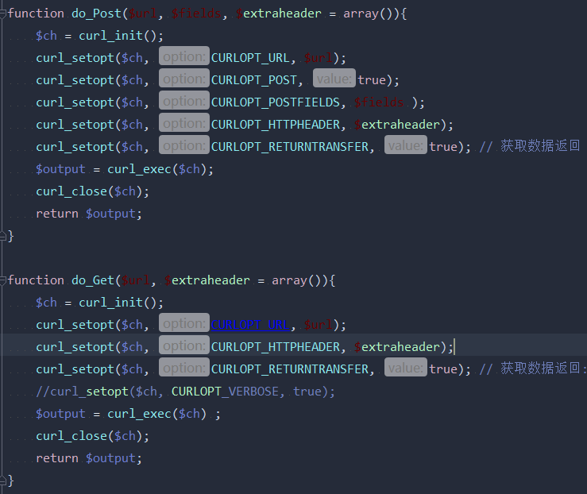
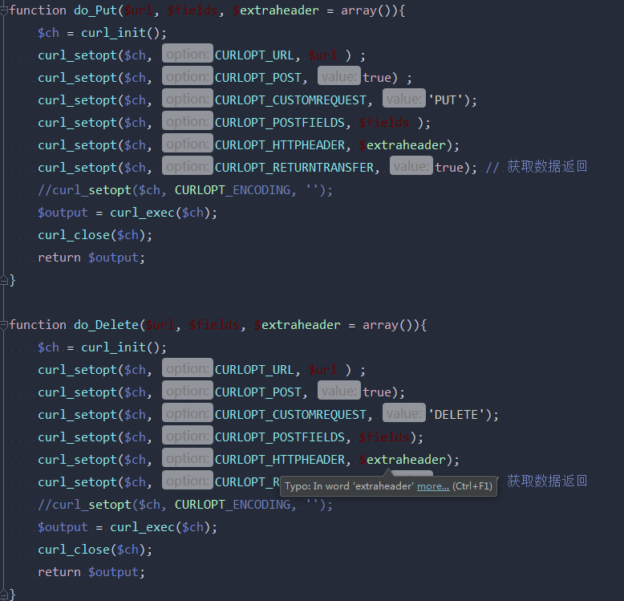

### PHPUnit接口自动化测试

		//初始化
        $ch = curl_init();
        //设置选项，包括URL
        curl_setopt($ch, CURLOPT_URL, $url);
        curl_setopt($ch, CURLOPT_RETURNTRANSFER, 1);
        curl_setopt($ch, CURLOPT_HEADER, 0);
        //执行并获取HTML文档内容
        $output = curl_exec($ch);
        //释放curl句柄
        curl_close($ch);
        return do_GET($url);