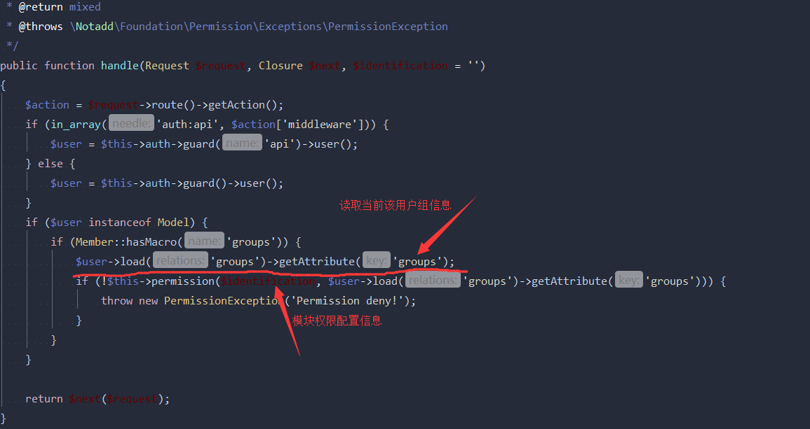
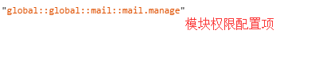
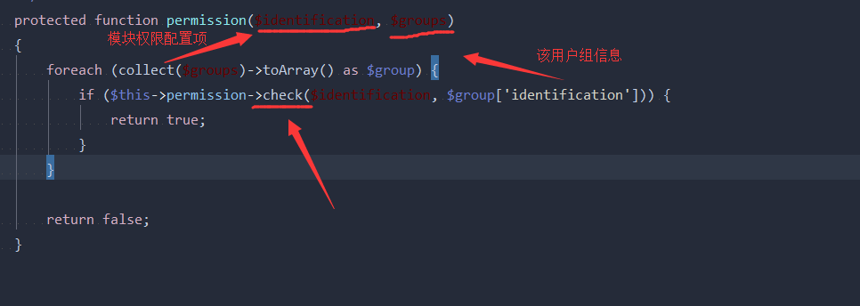
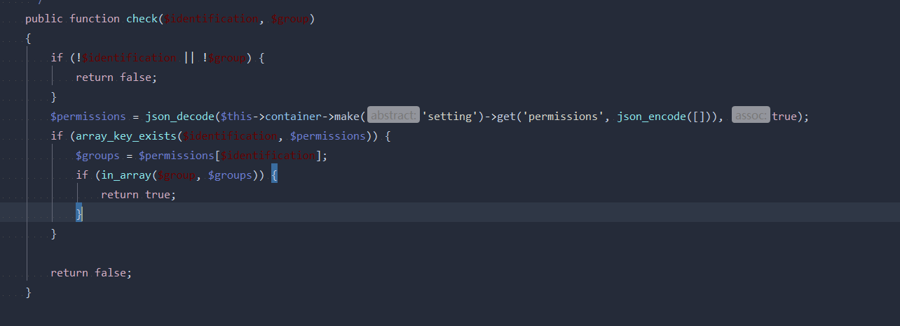
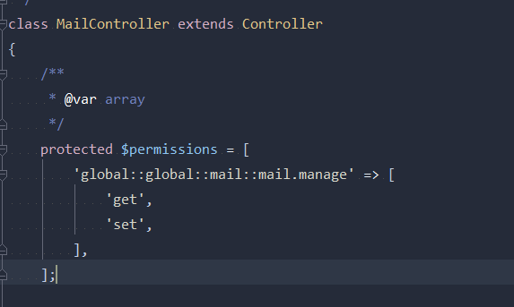

# notadd
详情见官方文档。Notadd 是基于Laravel 和 Vue 的开源PHP框架， 由于其本身的灵活性和先进的技术架构，使得你通过模块（主功能）、插件（功能增强）、模板（前端样式）像搭积木一样组合成你想要的，诸如：商城、CMS、微信、论坛… 快速完成开发。 Notadd 像操作系统一样，你可以通过安装“软件”，成为适用于你的“电脑”。

## notadd权限
经过查看了notadd源码了解到它的权限管理流程，核心代码主要集中在

* /vendor/notadd/framework/src/Permission/Permission.php
* /vendor/notadd/framework/src/Permission/PermissionManager.php

调用Permission.php文件下的permission方法

传入模块权限配置项跟用户组信息调用permissionManager.php文件下的check方法

先判断传入的模块权限配置项是否在setting表key=permissions的数组里面
然后再判断当前用户组是否在setting设置的模块权限用户组里面

模块权限配置项写在Control控制器里面

