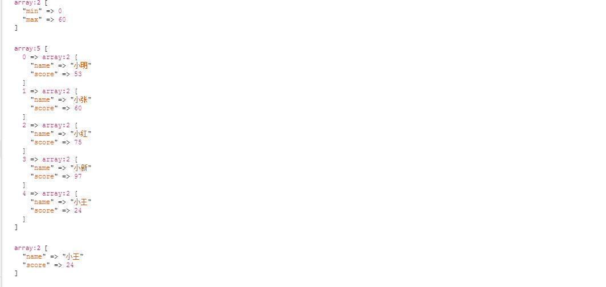

### 获取指定范围内中间值的最接近数

由图看出条件范围区间0~60，中间值是30，最接近30的数是24

### 代码

	public function NextMiddleNumber($Number,$NumberRangeArray)
	{
		$w = 0;
		$c = -1;
		$abstand = 0;
		$middle = ($Number['max']+$Number['min'])/2;
		$l = count($NumberRangeArray);
		for ($pos=0; $pos < $l; $pos++) {
			$n = $NumberRangeArray[$pos]['score'];
			$abstand = ($n > $middle) ? $middle - $n : $n - $middle;
			if ($c == -1) {
				$c = $abstand;
				continue;
			} else if ($abstand > $c) {
				$c = $abstand;
				$w = $pos;
			}
		}
		return $NumberRangeArray[$w];
	}

>