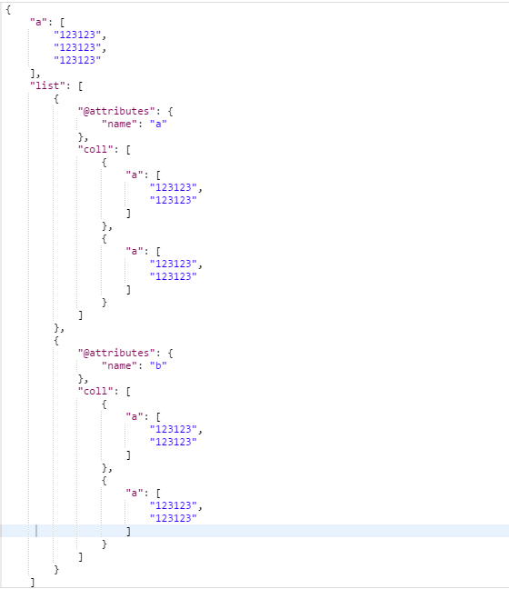
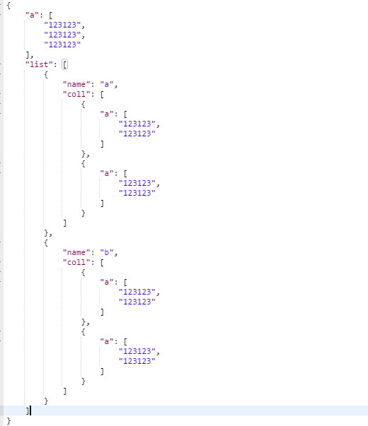

### XML TO JSON
xml转换json遇到带属性的xml格式问题

##### 待转换XML数据
	<?xml version="1.0" encoding="UTF-8" ?>
	<besp>
	<a>123123</a>
	<a>123123</a>
	<a>123123</a>
	<list name='a'>
		<coll>
			<a>123123</a>
			<a>123123</a>
		</coll>
		<coll>
			<a>123123</a>
			<a>123123</a>
		</coll>
	</list>
	<list name='b'>
		<coll>
			<a>123123</a>
			<a>123123</a>
		</coll>
		<coll>
			<a>123123</a>
			<a>123123</a>
		</coll>
	</list>
	</besp>

##### 常规代码
	$xml = simplexml_load_string($resXml);
	$json = json_encode($xml);
	$array = json_decode($json,TRUE);

> 使用simplexml_load_string函数解析待属性格式的xml数据会出现@attributes

		

##### 改进后
	function XML2JSON($xml)
    {
        normalizeSimpleXML(simplexml_load_string($xml), $result);
        return json_encode($result);
    }

    function normalizeSimpleXML($obj, &$result)
    {
        $data = $obj;
        if (is_object($data)) {
            $data = get_object_vars($data);
        }
        if (is_array($data)) {
            foreach ($data as $key => $value) {
                $res = null;
                normalizeSimpleXML($value, $res);
                if (($key == '@attributes') && ($key)) {
                    $result = $res;
                } else {
                    $result[$key] = $res;
                }
            }
        } else {
            $result = $data;
        }
    }

* <a href="http://php.net/manual/zh/class.simplexmlelement.php#Hcom108867" target="view_window">`详情参考PHP官方手册`</a>