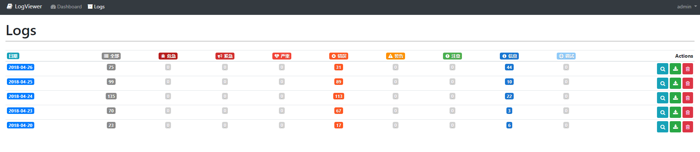

### Laravel Log Viewer
一个laravel日志管理查看的扩展包，

* <a href="https://github.com/ARCANEDEV/LogViewer" target="view_window">`github地址: https://github.com/ARCANEDEV/LogViewer`</a>

#### 执行代码
	composer require arcanedev/log-viewer

	php artisan log-viewer:publish 

> 详情文档可以查看该项目