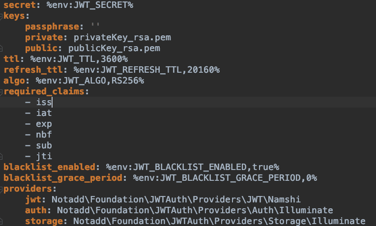
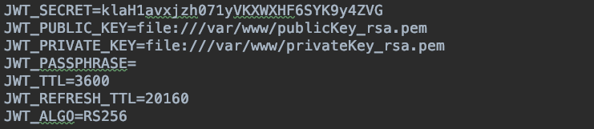
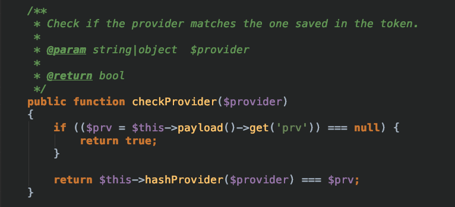
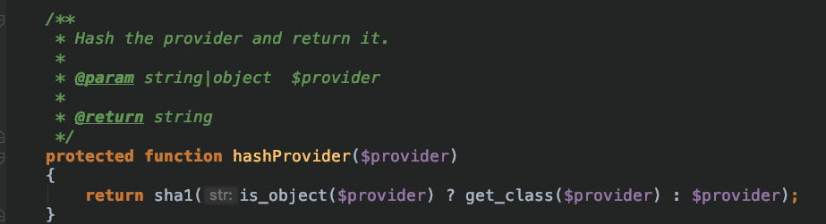

## notadd jwt遇到的问题

因notadd框架PHP版本不再维护,现将原有架构逐一拆分为微服务,在重构用户注册模块遇到的jwt问题.
因原有注册登陆采用jwt认证,用laravel重写后发现新的token无法进行认证.

#### notadd jwt 配置

#### laravel jwt 配置
packagist tymon/jwt-auth

经查看notadd源码,发现问题关键位置位于vendor/notadd/framework/src/JWTAuth/JWT.php line 278

如图所示,这段代码对比了prv是否一致,如果不一致则return false.
那这个prv是什么呢?查看jwt配置文件注释发现

    /*
    |--------------------------------------------------------------------------
    | Lock Subject
    |--------------------------------------------------------------------------
    |
    | This will determine whether a `prv` claim is automatically added to
    | the token. The purpose of this is to ensure that if you have multiple
    | authentication models e.g. `App\User` & `App\OtherPerson`, then we
    | should prevent one authentication request from impersonating another,
    | if 2 tokens happen to have the same id across the 2 different models.
    |
    | Under specific circumstances, you may want to disable this behaviour
    | e.g. if you only have one authentication model, then you would save
    | a little on token size.
    |
    */

    'lock_subject' => true,

这里详细指出了prv是一个身份验证模型,存放在载荷（Payload）里面,用于防止他人冒充.

经代码调试发现prv生成规则是采用sha1算法加密模型.而notadd的验证模型是Notadd\Foundation\Member\Member
laravel的验证模型为APP\User

目前博主采用的解决方案是通过设置载荷（Payload）把laravel的身份验证模型改为Notadd\Foundation\Member\Member

    JWTAuth::claims(['prv' => sha1('Notadd\Foundation\Member\Member')]);

设置成功后生产token即可

    \Auth::guard()->attempt($request->only(['name', 'password']));
    $user = \Auth::guard()->user(); 
    $token = JWTAuth::fromUser($user);   

* 如有更好的方案望指出