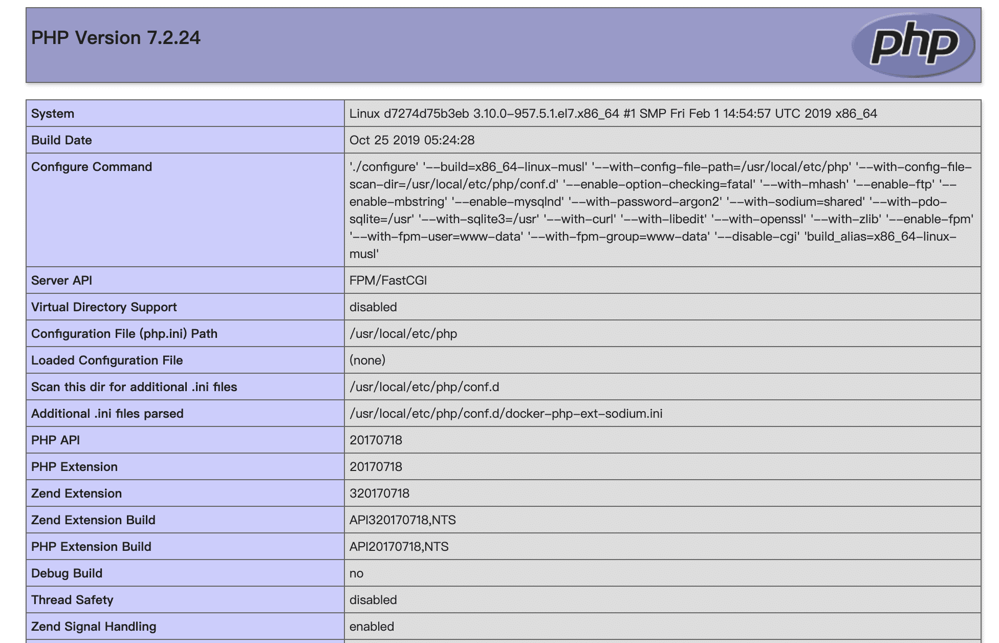

## docker搭建nginx+php-fpm环境

关于docker的安装和基本常用命令请读者自行google,本文不做阐述
本次示例所用的系统和docker版本
* centos7.5
* Docker version 1.13.1

#### php搭建
```
    docker pull php:7.2-fpm-alpine    // 拉取镜像
    docker run -d --name=php -v /data/wwwroot:/var/www/html php:7.2-fpm-alpine 
```
`注意:`-v是挂载文件 -v 主机目录:容器目录 /data/wwwroot目录为当前作者主机的目录,读者请自行创建网站目录

#### nginx搭建
```
    docker pull nginx:alpine    // 拉取镜像
    mkdir -p /data/nginx/conf.d    // 创建nginx配置文件目录
    docker run -d --name=nginx-conf nginx:alpine    // 运行临时容器把nginx默认配置文件复制到宿主机,这样做的目的是为了有些人不会写nginx配置
    docker cp nginx-conf:/etc/nginx/conf.d/default.conf /data/nginx/conf.d/
    docker stop nginx-conf    // 停止临时容器
    docker rm nginx-conf    // 删除临时容器
    
    docker run -d --name=nginx -p 8080:80 -v /data/wwwroot:/usr/share/nginx/html -v /data/nginx/conf.d:/etc/nginx/conf.d --link php nginx:alpine    // 运行nginx容器把网站目录和配置文件挂载到容器内部
    
    echo '<h1>hello world!</h1>' > /data/wwwroot/index.html    // 此时打开浏览器输入ip:8080应该就能看到nginx已经搭建成功
```
`注意:`-v是挂载文件 -v 主机目录:容器目录 /data/wwwroot目录为当前作者主机的目录,读者请自行创建网站目录

### 修改nginx配置
```
    vi /data/nginx/conf.d/default.conf    // 打开以下注释并修改端口
    
    location / {
        root   /usr/share/nginx/html;
        index  index.html index.htm index.php;
    }
    location ~ \.php$ {
        root           /usr/share/nginx/html;
        fastcgi_pass   php:9000;
        fastcgi_index  index.php;
        fastcgi_param  SCRIPT_FILENAME  /var/www/html/$fastcgi_script_name;
        include        fastcgi_params;
    }
    
    rm -rf /data/wwwroot/index.html
    echo '<?php phpinfo();' > /data/wwwroot/index.php
    docker restart nginx    // 重启nginx容器并打开浏览器输入ip:8080,此时应该能看到php相关信息如下图所示
```



### 修改php版本
```
    docker stop php
    docker rm php
    docker pull php:7.3-fpm-alpine    // 拉取7.3镜像
    docker run -d --name=php -v /data/wwwroot:/var/www/html php:7.3-fpm-alpine    // 运行php7.3容器并打开浏览器输入ip:8080,此时应该能看到php相关信息如下图所示
```


